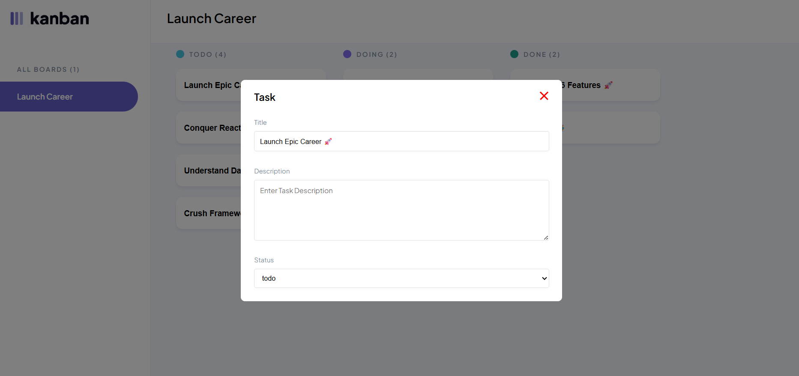

# 🗂️ JSL04: Overlay-Based Task Manager

## 📋 Overview

This project is a simple overlay-based task manager with preloaded tasks divided into three categories: `todo`, `doing`, and `done`. Each task can be opened individually to display detailed information in an overlay. The overlay shows the task title, description, and current status, and includes a close button to return to the main view. It is fully responsive and works well on both laptops and mobile devices.

## 🛠️ Technologies Used

- Visual Studio Code  
- HTML  
- CSS  
- JavaScript  
- GitHub

## ✨ Features Created

- Clickable tasks that open in an overlay with detailed information.
- Task title, description, and status are clearly displayed in their respective categories.
- Close button in the overlay to return to the main task list.
- Responsive layout that adapts to different screen sizes.

## 🎯 Expected Outcome

A clean and functional task manager with an intuitive overlay feature. Users should be able to easily view and manage their tasks with a smooth, responsive interface across all devices.

## Expected Outcome Screenshot

